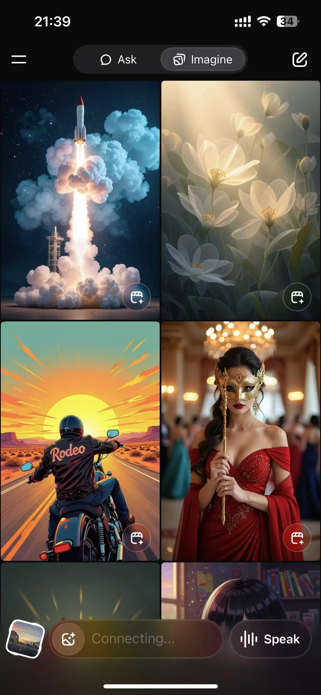

# xAI推出Grok Imagine：免费生成图片和15秒视频，连免费用户都能用

---

最近AI圈又热闹了。xAI发布了Grok Imagine功能，直接对标OpenAI的Sora和谷歌的Veo 3。最让人意外的是——**这玩意儿现在完全免费**。是的，你没看错，免费用户也能用。输入一段文字，几秒钟就能生成图片，点一下按钮还能把图片变成带音频的15秒视频。马斯克这次挺豪横。

---

## Grok Imagine能干什么

简单说，Grok Imagine就是个文生图、文生视频工具，集成在Grok AI聊天机器人里。你打开Grok应用（iOS或Android），点右上角"Imagine"标签，输入提示词，它就开始给你生成图片。生成速度挺快，几秒钟的事儿。

生成完图片后，你可以点"Make video"按钮，选个模式（Normal、Fun、Custom，还有个Spicy模式后面再说），它就自动给你做成最长15秒的视频，还带音频。或者你也可以直接上传手机里的照片，让它帮你把静态图变成动态视频。

技术层面，Grok Imagine用的是Aurora AI模型，这是个自动回归混合专家网络，用互联网上几十亿样本训练出来的，擅长做照片级别的渲染，也能比较准确地理解文字指令。它支持多模态输入——文字、语音、图片都行，**你可以上传现有图片让它帮你改，或者直接从零开始生成新内容**。

这里有个特别的"Spicy"模式，允许生成成人或敏感内容。马斯克把它叫做"meme motherlode"（梗图宝藏），强调娱乐和分享潜力。不过这个功能争议挺大，后面会提到。

## 原本计划10月发布，现在免费用户也能用了

👉 如果你还没体验过Grok的完整功能，不妨试试[Grok Super会员一个月成品号（质保30天），解锁全部高级特性](https://shaoyumi.com/buy/66)，省去注册和订阅的麻烦。

Grok Imagine的发布时间表挺有意思。最初计划是2025年10月开放早期测试，结果7月底就提前上线了。马斯克在7月29日发推说它处于早期测试阶段，优化目标是"最大乐趣"，还提到8月会用110,000个GB200 GPU训练更强的视频模型。

8月6日，iOS上的SuperGrok Heavy和Premium+用户可以用了，Android当时还没完全推出。到8月8日，xAI直接宣布**对所有Grok应用用户免费开放**。这个变化可能是xAI想快速扩大用户基础的策略。实测更新到最新版Grok客户端后，免费账号确实能用。

## 怎么用Grok Imagine

注意：**目前这功能只在移动端开放，网页版还没有**。

先去Google Play或App Store下载Grok应用，打开后注册登录。界面很简单，右上角点"Imagine"就进去了。

**生成图片的步骤：**

1. 点右上角"Imagine"标签或"Create Image"按钮
2. 输入文字提示，比如"一个在阳光下骑复古自行车的人"，或者直接上传手机里的照片让它帮你改
3. Grok会生成图片和几个变体，往下滑还能看到更多选项
4. 满意的话直接分享或下载到手机

**生成视频的步骤：**

1. 图片生成后，选"Make video"选项
2. 选模式：Normal（普通）、Fun（有趣）、Custom（定制）或Spicy（成人内容，慎用）
3. 等几秒，视频就出来了，最长15秒，带音频
4. 可以分享或下载

**把手机里的图片转成视频：**

1. 点应用底部的照片加号图标
2. 从手机上传图片
3. 等几秒，视频自动生成

## 免费用户能生成多少内容

这点马斯克确实大方。目前免费用户能近乎无限制地使用Grok Imagine功能。

实测了一下，输入"给DataLearnerAI做广告图片"这样的提示词，它一次性生成了好多不同风格的图片，往下拉还有更多。每张图片右下角都有个按钮，点一下就能再生成对应的视频。

感觉就像看着美金在燃烧。不过能白嫖的时候不白嫖，那还等什么呢。

## 争议和问题

技术创新归技术创新，Grok Imagine也引发了不少讨论。

马斯克把它叫做"AI Vine"，暗示它有短视频分享潜力，类似当年那个已经停运的Vine应用。但问题主要出在"Spicy"模式上。这个模式允许生成成人或敏感内容，TIME和国家性剥削中心等组织都指出，这功能可能被用来制作未经同意的深度伪造内容或非法材料。他们呼吁xAI在公开发布前实施更严格的保护措施。

另外，Aurora AI背后的计算基础设施投入也挺大。xAI计划用超过100,000个NVIDIA GPU来做实时处理，这反映了他们在多模态AI领域的野心，但同时也意味着更多的监管和公众审视。

实际体验下来，虽然有些视频效果不错，但配音还是有点突兀，听起来不太自然。技术还在迭代中吧。

---

## 总结

Grok Imagine是个挺有意思的工具。文生图、文生视频、图生视频都能做，速度快，还免费。对于想快速生成内容的人来说，这个工具确实方便。**如果你想深度体验Grok的全部功能，**👉 [可以考虑Grok Super会员一个月成品号（质保30天）](https://shaoyumi.com/buy/66)，省去繁琐的订阅流程，直接开始创作。

当然，"Spicy"模式的争议还在继续，技术本身也还有提升空间。但就目前来看，xAI这次确实给了个不小的惊喜。有兴趣的话，直接下载Grok应用试试吧。
